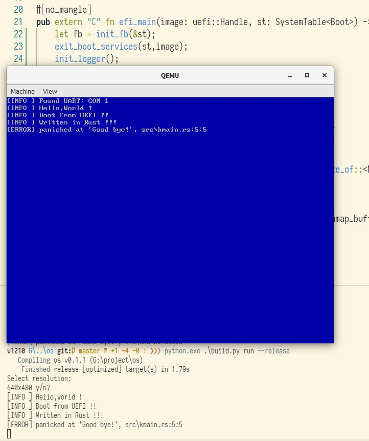

# Operating System

My "operating system" ! Written in Rust. Only support UEFI x86_64 now.

## Build tools

- [bootuefi](https://github.com/12101111/bootuefi)

- [OVMF](https://github.com/tianocore/tianocore.github.io/wiki/OVMF):

Install OVMF and set `bios = "<path to OVMF.fd>"` in `Cargo.toml`.

**Note**: you can download [Gerd Hoffmann's OVMF builds](https://www.kraxel.org/repos/jenkins/edk2/) (edk2.git-ovmf-x64*.noarch.rpm) and use `OVMF_CODE.fd`.

## Run

```shell
cargo run -Z build-std=core
```


